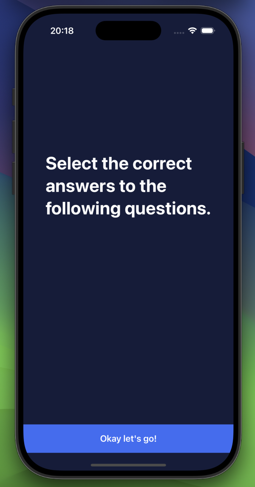
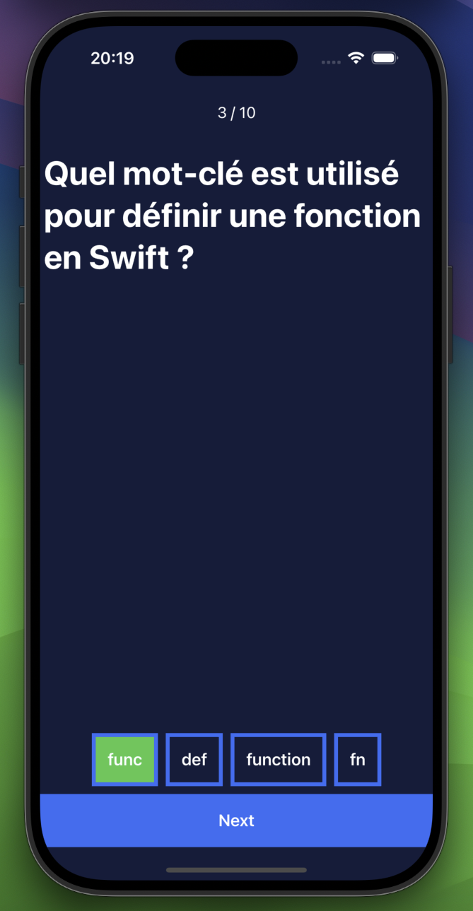
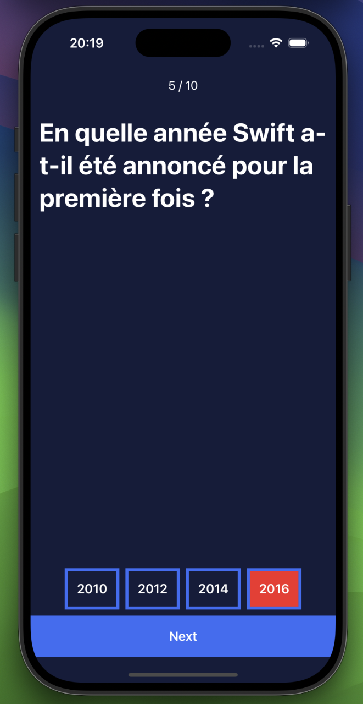

# 🧠 SwiftlyQuiz — iOS Quiz App (MVVM)

Swift Quiz is a native iOS app built with **Swift** using the **MVVM architecture**.  
It allows users to test their Swift programming knowledge through fun and interactive quizzes.  
The project follows a **clean, maintainable, and scalable structure** — perfect for learning modern iOS development.

---

## 🚀 Features
- Built with **Swift** and **SwiftUI**
- **MVVM architecture** for clean separation of concerns
- Interactive multiple-choice quizzes
- Dynamic question and score handling
- Responsive design for all iPhone sizes

---

## 🧩 Architecture
The app follows the **MVVM pattern**:

| Intro Screen | Correct Answer | Wrong Answer |
|  |  |  |
